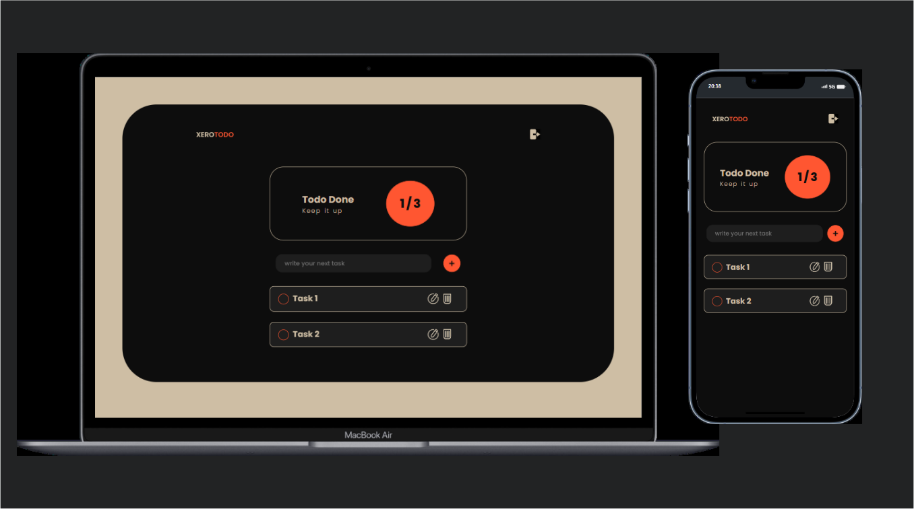

<h1 align="center"> XEROTODO </h1>

Programa desenvolvido para acomapanhaemnto de tarefas diaria  
<a href="https://activities-list.vercel.app/">Clique e veja a versão publicada.</a>

  <a href="#-tecnologias">Tecnologias</a>   |   
  <a href="#-projeto">Projeto</a>   |   
  <a href="#-layout">Layout</a>

 

  

# # 🚀 Tecnologias

Esse projeto foi desenvolvido com as seguintes tecnologias :

#### -HTML e CSS
#### -JavaScript
#### -Git e Github
#### -Dribbble.com

# # 💻 Projeto

O "XEROTODO" foi desenvolvido para treinamento e prática de desenvolvimento.

A aplicação é para organização de tarefas do dia-a-dia

# # 🔖 Layout

Layout desenvolvido para todos dispositivos.

